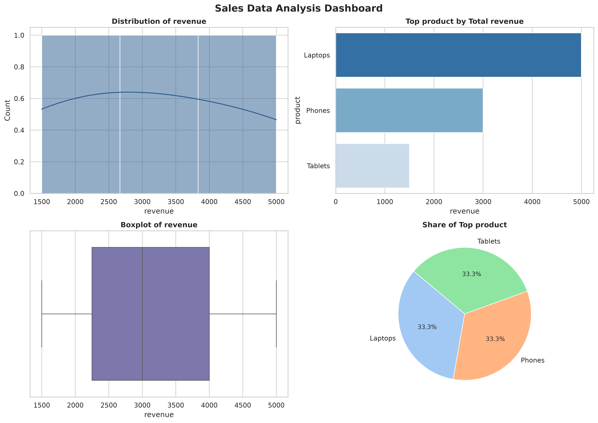

# ComputeAgent 🧠📊

An asynchronous, AI-powered data analysis platform built with a containerized microservices architecture. ComputeAgent allows users to upload datasets and natural language prompts, securely executing AI-generated Python code in isolated sandboxes to produce data visualizations and insights.


*Example output: A multi-panel sales data dashboard generated dynamically in a secure, ephemeral container.*

## 🏗️ System Architecture

This platform is designed around a distributed, event-driven architecture to ensure high performance and strict security boundaries.

* **Frontend:** React, TypeScript, and Vite, served via an **Nginx** web server.
* **Backend API:** **FastAPI** handling RESTful routing and artifact management.
* **Message Broker:** **Redis** for asynchronous task queuing.
* **Background Workers:** **Celery** workers that distribute heavy AI processing away from the main web thread.
* **Database:** **PostgreSQL** for persistent execution tracking and state management.
* **Execution Environment:** Isolated **Docker-in-Docker** sandboxing. The worker daemon dynamically spins up restricted, unprivileged Linux containers to execute generated code.

## 🔒 Security Features

* **Socket Isolation:** The web container is completely isolated from the host Docker socket.
* **Privilege Dropping:** Code execution runs as a restricted, unprivileged user (UID 1000) inside the sandbox.
* **POSIX Permissions:** Shared named volumes are strictly locked down using precise process ownership (`chown`) and restricted directory permissions (`chmod 755`) to prevent privilege escalation.

## 🚀 How to Run Locally

1. Ensure **Docker Desktop** (or the Docker daemon) is running.
2. Clone the repository and navigate into the root directory:

   ```bash
   git clone https://github.com/yourusername/ComputeAgent.git
   cd ComputeAgent
   ```

3. Build and launch the entire microservices stack:

   ```bash
   docker-compose up -d --build
   ```

4. Access the platform:

   - **Web UI:** `http://localhost:5173`
   - **API Documentation:** `http://localhost:8000/docs`

## 🛑 Shutting Down

To gracefully shut down the infrastructure and free up system resources, run:

```bash
docker-compose down
```

## ⚙️ CI/CD Pipeline

The repository includes a fully configured **GitHub Actions** workflow (`.github/workflows/docker-publish.yml`). Upon pushing changes to the `main` branch, the workflow automatically:

1. Tests and validates the codebases.
2. Compiles production assets.
3. Builds and pushes versioned Docker images to the **GitHub Container Registry (GHCR)**:
* `ghcr.io/yourusername/computeagent-frontend:latest`
* `ghcr.io/yourusername/computeagent-backend:latest`


---

## 🌐 Production Cloud Deployment (Using GHCR Images)

Because the background worker requires access to the host Docker daemon (`/var/run/docker.sock`) to spawn ephemeral sandboxes, deploy the platform to a Linux Virtual Machine (e.g., AWS EC2, GCP Compute Engine, Oracle Cloud, or DigitalOcean Droplet).

Using pre-built images from GHCR eliminates the need to compile code or install Node/Python on the production server.

### 1. Prepare the Production Compose File

Create a `docker-compose.prod.yml` file on your cloud server:

```yaml
services:
  frontend:
    image: ghcr.io/yourusername/computeagent-frontend:latest
    container_name: computeagent-frontend
    ports:
      - "80:80"
    restart: always
    depends_on:
      - web

  web:
    image: ghcr.io/yourusername/computeagent-backend:latest
    container_name: computeagent-web
    command: sh -c "uv run uvicorn main:app --host 0.0.0.0 --port 8000"
    volumes:
      - shared_workspaces:/app/workspaces
    environment:
      - DATABASE_URL=postgresql://user:password@db:5432/compute_db
      - REDIS_URL=redis://redis:6379/0
    restart: always
    depends_on:
      - db
      - redis

  worker:
    image: ghcr.io/yourusername/computeagent-backend:latest
    container_name: computeagent-worker
    command: sh -c "uv run celery -A worker.celery_app worker --loglevel=info"
    volumes:
      - /var/run/docker.sock:/var/run/docker.sock
      - shared_workspaces:/app/workspaces
    environment:
      - DATABASE_URL=postgresql://user:password@db:5432/compute_db
      - REDIS_URL=redis://redis:6379/0
      - GEMINI_API_KEY=${GEMINI_API_KEY}
    restart: always
    depends_on:
      - db
      - redis

  db:
    image: postgres:15-alpine
    container_name: computeagent-db
    environment:
      - POSTGRES_USER=user
      - POSTGRES_PASSWORD=password
      - POSTGRES_DB=compute_db
    volumes:
      - postgres_data:/var/lib/postgresql/data
    restart: always

  redis:
    image: redis:7-alpine
    container_name: computeagent-redis
    restart: always

volumes:
  postgres_data:
  shared_workspaces:

```

### 2. Deploy to Server

1. **SSH into the cloud VM** and install Docker:
```bash
curl -fsSL [https://get.docker.com](https://get.docker.com) -o get-docker.sh
sudo sh get-docker.sh

```


2. **Authenticate with GHCR** using a GitHub Personal Access Token (PAT with `read:packages` scope):
```bash
echo "YOUR_GITHUB_PAT" | sudo docker login ghcr.io -u yourusername --password-stdin

```


3. **Pull images and start the services**:
```bash
sudo docker compose -f docker-compose.prod.yml pull
sudo docker compose -f docker-compose.prod.yml up -d

```


4. **Verify Deployment**:
Open `http://<YOUR_SERVER_PUBLIC_IP>` in your browser to access the dashboard.

```

```